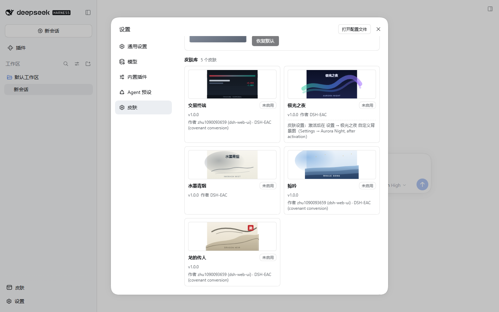
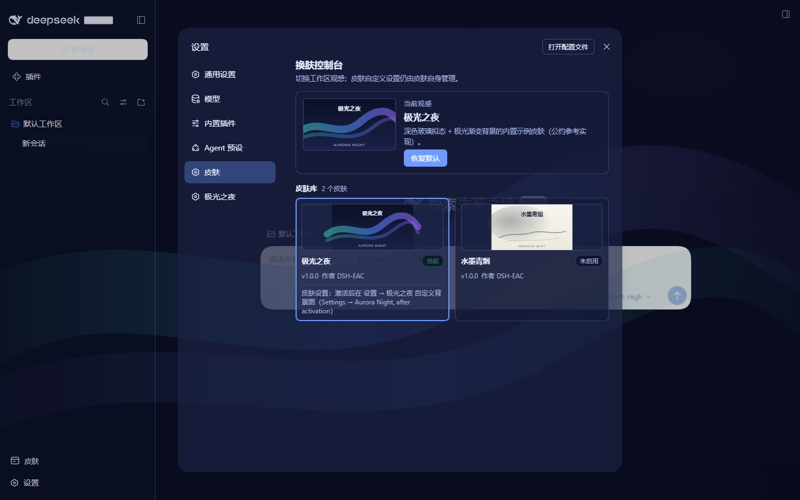
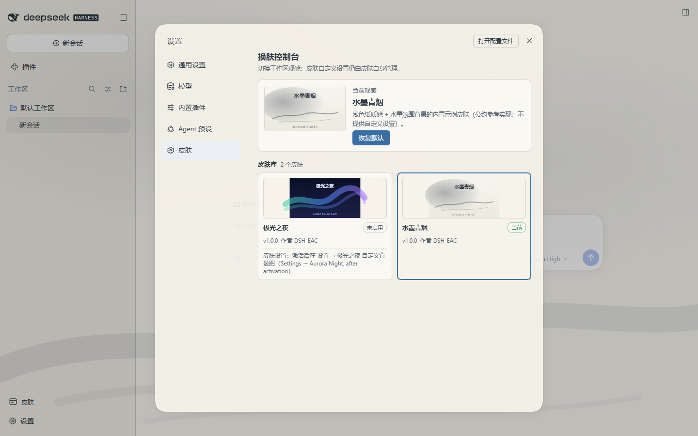
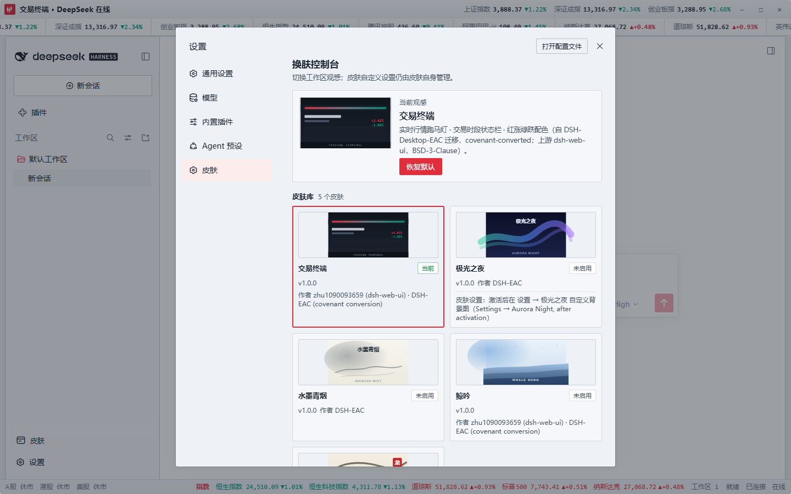
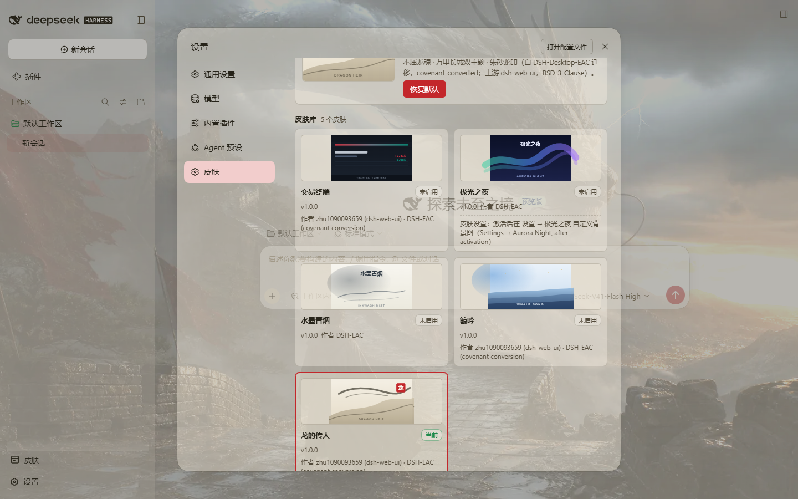
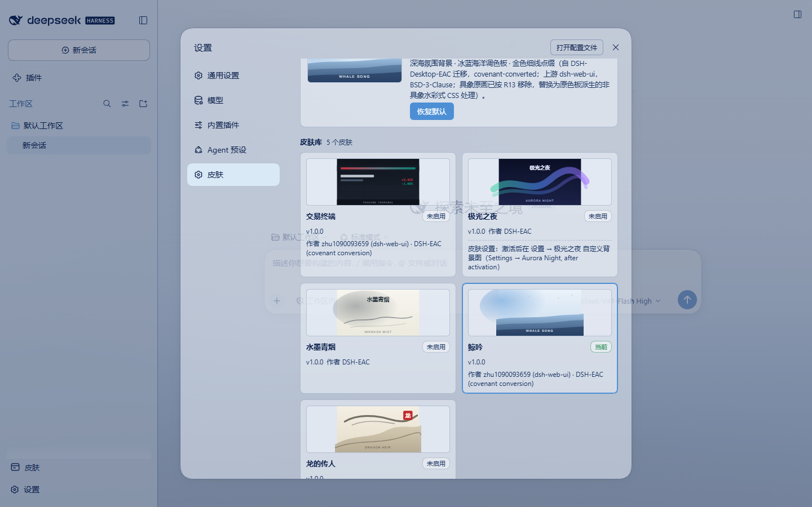

# dsh-ui-skin-loader

[](https://github.com/DSH-EAC/dsh-ui-skin-loader/actions/workflows/ci.yml)
[](./LICENSE)

**DSH UI 皮肤加载器**——弱约束公约 [`dsh.ecosystem.ui-skin-loader/v1`](https://github.com/DSH-EAC/dsh-ui-skin-loader-convention) 的参考实现：一个加载器加五款皮肤（2 款内置示例 + 3 款公约化迁移），装入 DSH 后即可在设置里一键换肤、随时彻底还原。

| 字段 | 值 |
| --- | --- |
| 公约 | `dsh.ecosystem.ui-skin-loader/v1`（[公约仓库](https://github.com/DSH-EAC/dsh-ui-skin-loader-convention)） |
| 适配宿主 | `@deepseek-ai/dsh` `0.1.7-rc.2` |
| 运行时 | Node.js >= 24（源码经 Node 原生 type-stripping 直接执行） |
| 当前版本 | 1.0.0（[CHANGELOG](./CHANGELOG.md)） |

## 它是什么

- **加载器**（`@dsh-eac/ui-skin-loader`）：皮肤发现登记、全局互斥切换、持久化与跨重启恢复、故障隔离（激活抛错回滚 / 关闭超时如实标记疑似残留）、跨标签页同步，以及设置页里的换肤控制台（亮暗双案自适应）。
- **皮肤**：一个遵循公约的皮肤插件在未激活时**零副作用**（只登记元数据），激活后才产生可见副作用，被换走或停用时**彻底关闭**——宿主观感与它从未激活时逐像素一致。五款皮肤全部通过公约 §9 发布前自检（六问 × 逐款，实机断言佐证）。

## 安装

### 前置条件

- [DSH](https://www.npmjs.com/package/@deepseek-ai/dsh) `0.1.7-rc.2`（`dsh` 命令行可用）；
- Node.js **>= 24**（构建安装包时需要 pnpm 11；安装动作本身由 `dsh` 驱动）。

### 1. 构建安装包

克隆本仓后在工作区根执行依赖安装与构建，再对六个包逐个 `npm pack`：

```bash
pnpm install
pnpm build        # tsc --noEmit + esbuild-wasm 产出各包 lib/ 可安装产物

mkdir -p dist
npm pack --pack-destination dist          # 在 packages/loader 执行
# 再在 packages/skins/{aurora,inkwash,trading,dragon-heir,whale-song} 各执行一次：
npm pack --pack-destination <dist 绝对路径>
```

得到 6 个 tarball：加载器 1 个 + 皮肤 5 个。

```text
dsh-eac-ui-skin-loader-1.0.0.tgz
dsh-eac-skin-aurora-1.0.0.tgz          极光之夜
dsh-eac-skin-inkwash-1.0.0.tgz         水墨青烟
dsh-eac-skin-trading-1.0.0.tgz         交易终端
dsh-eac-skin-dragon-heir-1.0.0.tgz     龙的传人
dsh-eac-skin-whale-song-1.0.0.tgz      鲸吟
```

### 2. 逐包装入 DSH

对每个 tarball 执行一次 `dsh plugin add`（profile 按需命名；皮肤包依赖加载器，建议先装加载器）：

```bash
dsh plugin --profile web add <dist>/dsh-eac-ui-skin-loader-1.0.0.tgz
dsh plugin --profile web add <dist>/dsh-eac-skin-aurora-1.0.0.tgz
dsh plugin --profile web add <dist>/dsh-eac-skin-inkwash-1.0.0.tgz
dsh plugin --profile web add <dist>/dsh-eac-skin-trading-1.0.0.tgz
dsh plugin --profile web add <dist>/dsh-eac-skin-dragon-heir-1.0.0.tgz
dsh plugin --profile web add <dist>/dsh-eac-skin-whale-song-1.0.0.tgz
```

安装形态说明（tarball 链路实测）：

- tarball 以复制方式装入 profile（依赖随包装入，`dsh.profile.bundles` 自动追加），**安装即启用**；
- 同路径同名重装需先 `dsh plugin --profile web remove <包名>` 再 add（包管理器对相同 `file:` 规格会跳过重装）；
- 本仓验证战役（V2 项）即以此命令序列在全新隔离环境装入六包、boot 零 error/warn，全过程见 [`docs/verification.md`](./docs/verification.md)。

### 3. 使用：打开设置 → 皮肤控制台

启动（或重启）DSH 后，打开 **设置 → 皮肤** 即见换肤控制台：

- **卡片墙**列出全部已安装皮肤（未激活的皮肤零副作用，只显示元数据与封面）；
- 点击卡片**激活**（全局互斥：任意时刻至多一款皮肤生效），hero 区的「恢复默认」一键回到宿主原生观感；
- 选择**跨重启自动恢复**；激活抛错自动回滚并在卡内呈现错误原文，关闭异常会如实标记「疑似残留」；
- 带自定义设置的皮肤（极光之夜）激活后，在 **设置 → 极光之夜** 提供其自有设置分区；无设置皮肤不被区别对待。

## 五皮肤画廊

安装后的皮肤控制台（5 卡齐全、均未激活，settled 全景）：



各皮肤激活态（截图档案存于 [`docs/images/`](./docs/images/)，实拍环境与验证矩阵见 [`docs/verification.md`](./docs/verification.md)）：

| 皮肤 | 激活态实拍 |
| --- | --- |
| 极光之夜（内置示例：深色玻璃拟态 + 极光渐变，带自定义设置） |  |
| 水墨青烟（内置示例：浅色纸质感 + 水墨氛围，无设置） |  |
| 交易终端（迁移：实时行情跑马灯 + 交易时段状态栏） |  |
| 龙的传人（迁移：不屈龙魂/万里长城双主题 + 朱砂龙印） |  |
| 鲸吟（迁移：深海氛围背景 + 冰蓝海洋调色板） |  |

## 仓库结构

```text
packages/
  loader/               @dsh-eac/ui-skin-loader    加载器（adapter + SkinRuntime + 控制台）
  skins/
    aurora/             @dsh-eac/skin-aurora       内置示例「极光之夜」（带设置面）
    inkwash/            @dsh-eac/skin-inkwash      内置示例「水墨青烟」（无设置）
    trading/            @dsh-eac/skin-trading      迁移皮肤「交易终端」（含 THIRD-PARTY-NOTICES.md）
    dragon-heir/        @dsh-eac/skin-dragon-heir  迁移皮肤「龙的传人」（含 THIRD-PARTY-NOTICES.md）
    whale-song/         @dsh-eac/skin-whale-song   迁移皮肤「鲸吟」（含 THIRD-PARTY-NOTICES.md）
docs/
  api-notes.md          DSH 0.1.7-rc.2 API 实机核对笔记（adapter 的权威依据）
  verification.md       验证矩阵 V1-V11 + Phase 3 迁移皮肤验收实跑报告
  images/               README 画廊截图（实拍档案）
CHANGELOG.md            版本变更记录
```

## 开发

环境要求：Node >= 24、pnpm 11。

```bash
pnpm install        # 安装依赖并生成 lockfile
pnpm lint           # ESLint（typescript-eslint flat config，递归全部包）
pnpm test           # node --test 直接运行各包 .test.ts（递归全部包）
pnpm build          # tsc --noEmit + esbuild-wasm 产出可安装产物（lib/，gitignored）
pnpm typecheck      # tsc --noEmit 类型检查（递归全部包）
```

## 运行时策略

- TypeScript 源码由 **Node 24 原生 type-stripping** 直接执行：`.ts` 文件不经编译产物，`node --test` 直接运行测试。
- 因此源码只允许可擦除 TS 语法：**禁用 enum / namespace / 装饰器 / 参数属性**。
- `tsc --noEmit` 仅做类型检查，不参与运行。

## 皮肤开发者指引

皮肤 client bundle 顶层导出 cordis 服务注入与 apply；在 apply 内向加载器登记
`SkinRegistration`，并把反登记包进 `ctx.effect`（fiber 卸载自动撤销登记）：

```ts
// 皮肤 client bundle 顶层
export const inject = ["uiSkinLoader"]; // 还需要 slots/theme/locale 等服务时自行追加

export function apply(ctx) {
  // 登记 ≠ 激活：registerSkin 只入发现表，零副作用
  const unregister = ctx.uiSkinLoader.registerSkin({
    apiVersion: "dsh.ecosystem.ui-skin-loader/v1",
    id: "example.aurora", // 公约 §3：[a-z0-9]+(?:[.-][a-z0-9]+)*
    name: "极光之夜",
    version: "1.0.0",
    activate(skinCtx) { /* 自此才允许可见副作用；经 skinCtx.slots 登记 */ },
    deactivate() { /* 撤销 activate 以来的全部副作用 */ },
  });
  ctx.effect(() => unregister);
}
```

- **登记 ≠ 激活**：`registerSkin` 只入发现表，零副作用；激活只经加载器的
  `switchTo` 状态机（公约 §4）。
- 完整 `SkinRegistration` / `SkinContext` 契约见 `packages/loader/src/protocol.ts`
  （公约 §3/§4/§6 的冻结面）。
- **上手材料**：公约 §9 最小皮肤骨架（[`dsh-ui-skin-loader-convention/examples/minimal-skin`](https://github.com/DSH-EAC/dsh-ui-skin-loader-convention/tree/main/examples/minimal-skin)）；
  五款真实皮肤的包结构、接线与会话实现见各包 `packages/skins/<id>/README.md`
  （有设置看 aurora，无设置看 inkwash，上游观感迁移看 trading/dragon-heir/whale-song）。

## 验证

验证矩阵 **V1-V11**（干净 boot / tarball 安装链 / 单元测试 / 控制台亮暗渲染 / 热切换零残留 / 持久化 / 跨标签页 / 故障隔离 / 卸载回归与路径审计 / 视觉验收 / 公约 §9 符合性）在 0.1.7-rc.2 隔离环境全量实跑通过；五皮肤全景、互斥混切与逐款公约自检见 [`docs/verification.md`](./docs/verification.md)。宿主 API 形态的唯一权威依据是 [`docs/api-notes.md`](./docs/api-notes.md)。

## 公约

- 公约仓库：<https://github.com/DSH-EAC/dsh-ui-skin-loader-convention>
- 本仓库是该公约的参考实现加载器；皮肤包与加载器的接缝以公约为准。

## License 与署名

- 本仓**工程骨架**（加载器、皮肤接线、构建与测试）以 [MIT](./LICENSE) 许可发布（© 2026 DSH EAC · 揽尽万象）。
- 三款迁移皮肤（交易终端 / 龙的传人 / 鲸吟）的**观感与行为内容**原样迁移自
  dsh-web-ui 预构建皮肤包（BSD-3-Clause © zhu1090093659，经
  DSH-Desktop-EAC@`26841f5` 分发），按其许可随包落档：来源、改动与许可全文见
  各包 [`THIRD-PARTY-NOTICES.md`](packages/skins/trading/THIRD-PARTY-NOTICES.md)。
